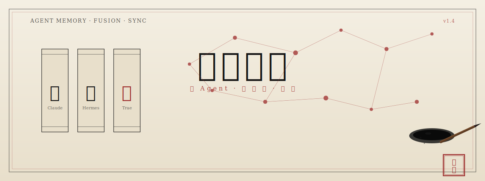
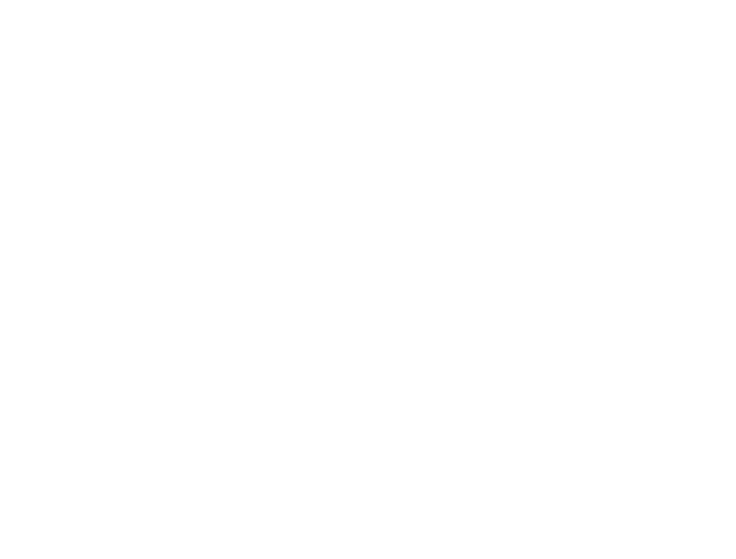

<div align="center">

</div>

# AgentMemorySystem

<div align="center">

**多 AI Agent 記憶融合 · 跨裝置同步系統**

[English](README_en.md) | **中文**


</div>

---

## 緣起

Claude、Hermes、Trae、Cursor、CodePilot 諸 Agent，各存其憶，格式互異，路徑散落，若孤島不相聞。

**AgentMemorySystem** 以一統之策，行「發現 → 提取 → 融合 → 寫回」四步，貫通各 Agent 記憶，使孤島成大陸。

**設計之道：**
- **本地為先** — 數據盡存本機，不上傳雲端
- **跨裝置同步** — 藉 OneDrive 或任意同步目錄，多機共享
- **即裝即用** — 單檔發佈，免 Python 環境
- **安全可靠** — 自動備份、衝突檢測、敏感詞過濾、一鍵回溯

## 特性

| 特性 | 說明 |
|------|------|
| **自動發現 Agent** | 候選路徑 + 特徵校驗，不依賴硬編碼路徑 |
| **原生格式寫回** | Claude 子檔案、Trae 章節、Hermes § 分隔、通用 Markdown |
| **融合去重** | 基於內容哈希之 SQLite 融合索引 |
| **分層儲存** | 熱 / 溫 / 冷三級資料，自動歸檔 |
| **安全機制** | 自動備份、檔案鎖、OneDrive 衝突檢測、敏感詞過濾 |
| **GUI + CLI** | 系統匣常駐程式 + 命令列工具 |

## 支援之 Agent

| Agent | 記憶格式 | 寫回方式 |
|-------|---------|---------|
| Claude | 子檔案 + `MEMORY.md` 索引 | 追加至 `shared/` 子檔案 |
| Hermes | `MEMORY.md` 尾部 `§` 分隔 | 追加 § 段落 |
| Trae | `user_profile.md` 章節 | 追加 `## Shared Knowledge` |
| CodePilot | SQLite (`codepilot.db`) | 匯出為 Markdown |
| Cursor / Windsurf / Cline / Continue / Aider / Roo-Code / Codex | 通用 Markdown | 自動適配 |

## 速覽

### 其一：源碼執行（推薦，初來者用）

**所需環境：**
- Python 3.10+
- Windows 10+ / Linux（GUI 需圖形環境）

```bash
git clone https://github.com/LEE20260315/AgentMemorySystem.git
cd AgentMemorySystem
pip install -r requirements.txt
python memory_sync_app.py          # 啟動 GUI
python memory_sync_app.py --cli    # 啟動 CLI
```

### 其二：跨裝置啟動器（進階）

此方案適合已在一台機器上打包過、欲跨裝置免裝 Python 即跑者。前提：**先在一台裝有 Python 與依賴的機器上執行 `python build.py` 打包**，生成 `AgentMemorySync/` 分發包後，再將整個專案目錄置於 OneDrive（或任一同步目錄）下。

1. 先在一台機器上完成上節「源碼執行」的安裝，再執行 `python build.py` 打包。
2. 將整個專案目錄置於你的 **OneDrive**（或任一同步目錄）下，使其跨機同步。
3. 在任一同步設備上，雙擊專案根目錄的 `AgentMemorySync.bat`。

啟動器會：

- 將專案內的 `AgentMemorySync/` 分發包同步到 `%TEMP%\AgentMemorySync_Run\`（本地副本，避免直接從 OneDrive 執行）
- 設定 `AGENT_MEMORY_DATA_DIR` 指回專案的 `AgentMemory/`（仍在 OneDrive 中），保證記憶跨機同步
- 啟動本地副本並讓托盤常駐

首次 `python build.py` 時還會建立桌面與開始功能表捷徑（指向 bat 並帶圖示）。

> **不要雙擊 `AgentMemorySync/` 裡的 EXE。** 啟動器是唯一指定進入點，目的是永遠從本地路徑跑程序，而非從 OneDrive 直接跑。

之後每次 `python build.py` 重新打包，下次啟動 `AgentMemorySync.bat` 會自動刷新本地副本，無需手動複製。

> **目前 Releases 頁面尚未發布預編譯 EXE。** 在官方 EXE 釋出前，請用上節「源碼執行」或自行 `python build.py` 打包。

### 常用之命

```bash
python memory_cli.py full-sync                     # 完整同步（發現 → 提取 → 融合 → 寫回）
python memory_cli.py redetect                      # 重新檢測 Agent
python memory_cli.py --agent claude write "記住此設計決策" --tags 開發
python memory_cli.py --agent claude search "關鍵字"
python memory_cli.py --agent claude health         # 健康檢查
python memory_cli.py --agent claude expire         # 清理過期記憶並歸檔
```

## 架構

```
本機 Agent 記憶檔案（Claude / Hermes / Trae / ...）
    │
    ▼
┌─────────────────────────────────────┐
│  sync_engine.py — 同步編排層        │
│  發現 → 提取 → 融合 → 寫回          │
└─────────────┬───────────────────────┘
              │
    ┌─────────┴─────────┐
    ▼                   ▼
┌──────────┐    ┌──────────────┐
│ SQLite   │    │ sync_writers │
│ 融合索引 │    │ 寫回適配器   │
└──────────┘    └──────────────┘
    │                   │
    ▼                   ▼
 內容哈希去重      按原生格式寫回
```

**分層之序：**
- **核心層** (`agent_memory.py`) — SQLite 儲存、並發控制、備份、壓縮、健康檢查
- **適配層** (`sync_writers.py`) — 各 Agent 寫回適配器
- **編排層** (`sync_engine.py`) — 發現 → 提取 → 融合 → 寫回
- **交互層** (`memory_sync_app.py`) — GUI + 系統匣 + CLI

## 配置

`config.json` 統轄諸參數：

```jsonc
{
  "paths": {
    "memory_root": "auto",      // 記憶根目錄，auto = 自動檢測
    "shared_root": "auto"       // 共享目錄
  },
  "limits": {
    "max_memories_per_agent": 10000,
    "max_memory_age_days": 365  // 記憶過期天數
  },
  "security": {
    "sensitive_patterns": ["password", "token", ...],
    "block_sensitive": false    // 是否攔截含敏感詞之寫入
  },
  "sync": {
    "conflict_strategy": "newer_wins",
    "lock_timeout_seconds": 30
  }
}
```

詳見倉庫中 `config.json` 檔案。

## 版次

| 版次 | 日期 | 要目 |
|------|------|------|
| **v1.3.3** | 2026-07 | 回聲污染自愈機制（`strip_sync_markers` + 段頭去重）、UI 精修（PIL 抗鋸齒狀態燈、托盤通知時長縮短、捷徑指向 bat + 圖示）、`.old_*` 備份自動清理、Agent 路徑覆蓋改為預置 + 自訂混合模式（支援 openclaw 等） |
| **v1.3.2** | 2026-06 | 資料目錄解析重定向至 OneDrive `AgentMemory/`、原生 Windows 托盤 API（不再依賴 pystray）、跨裝置啟動器穩定性強化 |
| **v1.3.1** | 2026-06 | 跨裝置啟動器：OneDrive 分發包 + 本地副本 + OneDrive `AgentMemory/` 綁定。托盤常駐恢復。 |
| **v1.3** | 2026-06 | GUI + 系統匣、EXE 封裝、自動同步排程、通用 Agent 發現、CodePilot 支援、鎖檔案過期修復 |
| **v1.2** | 2026-05 | 同步引擎、寫回適配器、SQLite 融合索引、OneDrive 衝突檢測 |
| **v1.1** | 2026-05 | 配置管理系統、日誌系統、敏感資訊檢測、健康檢查、記憶過期機制 |
| **v1.0** | 2026-05 | 核心庫、檔案鎖、裝置配置、Markdown 解析 |

詳見 [CHANGELOG.md](CHANGELOG.md)。

## 介面一瞥

<div align="center">



*主介面：即時日誌面板 + 智慧狀態燈 + 一鍵同步*

</div>

## 目錄

```
AgentMemorySystem/
├── agent_memory.py           # 核心引擎（SQLite、並發、備份、壓縮）
├── sync_engine.py            # 同步編排（發現 → 提取 → 融合 → 寫回）
├── sync_writers.py           # Agent 寫回適配器
├── safe_io.py                # 安全讀寫與資料目錄解析
├── memory_sync_app.py        # GUI + 系統匣 + CLI
├── memory_cli.py             # CLI 入口
├── build.py                  # 封裝腳本（python build.py → EXE）
├── AgentMemorySync.bat       # 跨裝置啟動器（由 build.py 生成）
├── config.json               # 配置檔
├── requirements.txt          # Python 依賴
├── pyproject.toml            # 包元資訊
├── assets/                   # 圖示資源
├── docs/                     # 文檔
├── tools/                    # 遷移腳本等工具
├── CHANGELOG.md              # 變更日誌
├── DEVLOG.md                 # 開發日誌
├── LICENSE                   # MIT 許可證
└── test_memory.py            # 測試用例
```

## 常見之問

**Q: 必需 OneDrive 否？**
A: 非必需。預設資料存於專案內 `AgentMemory/` 目錄，可於 `config.json` 指定任意路徑。OneDrive 僅供跨裝置同步。

**Q: 支援 macOS 否？**
A: CLI 直用無礙。GUI 基於 tkinter，macOS 安裝 Python 時需勾選 tcl/tk。

**Q: 記憶檔案被鎖定如何處置？**
A: 鎖檔案設有 60 秒自動過期機制。殘留鎖檔案會自動清理。

**Q: 如何回溯同步？**
A: 每次同步前自動備份原檔至 `.sync_backups/`，可藉 GUI 或 CLI 回溯。

**Q: 私隱安全如何保障？**
A: 寫入時自動檢測敏感資訊（密碼、密鑰、token 等），可配置攔截或僅警告。所有數據存於本機，不外傳。

**Q: 首次執行 EXE 時 Windows 顯示 SmartScreen 警告（「已保護你的電腦」），如何處置？**
A: 此為 Windows 對未簽署程式的標準提示，非病毒。點擊 **「更多資訊」** → **「仍要執行」** 即可。此操作每台機器僅需一次，之後 Windows 會記住此檔案的放行記錄。本專案為開源軟體，無商業程式碼簽署憑證，故有此提示。若介意，可改用源碼方式執行（見「速覽 · 其一」）。

## 共築

歡迎 Issue 與 Pull Request！

1. Fork 此倉庫
2. 建特性分支 (`git checkout -b feature/amazing-feature`)
3. 提交變更 (`git commit -m 'Add amazing feature'`)
4. 推送分支 (`git push origin feature/amazing-feature`)
5. 發 Pull Request

## 許可

[MIT License](LICENSE) © 2026 LEE20260315

---

<div align="center">


<sub>紙承墨，墨載意，意馭器</sub>

<sub>西城閒人 · 識</sub>

</div>