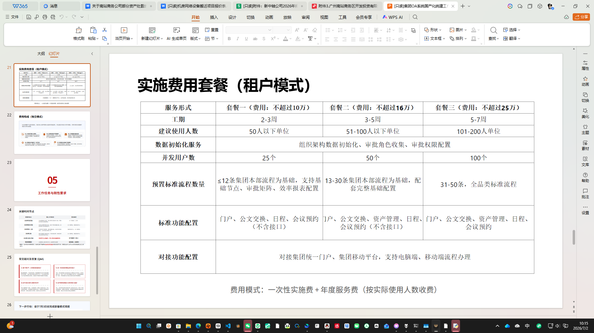

<div align="center">

</div>

# AgentMemorySystem

<div align="center">

**Multi-Agent Memory Fusion & Cross-Device Sync**

[**English**](README_en.md) | [中文](README.md)


</div>

---

## Overview

Claude, Hermes, Trae, Cursor, CodePilot — each AI agent keeps its own memory, in its own format, scattered across directories like isolated islands.

**AgentMemorySystem** unifies them through a four-step pipeline: **Discover → Extract → Merge → Write Back**.

**Design Principles:**
- **Local-first** — All data stays on your machine, no cloud dependency
- **Cross-device sync** — Via OneDrive or any sync folder
- **Zero-config** — single-file release, no Python required
- **Safe & reliable** — auto-backup, conflict detection, sensitive info filtering, one-click rollback

## Features

| Feature | Description |
|---------|-------------|
| **Auto Agent Discovery** | Candidate paths + signature validation, no hardcoded paths |
| **Native Format Write-back** | Claude sub-files, Trae sections, Hermes §-delimited, generic Markdown |
| **Merge & Dedup** | SQLite fusion index with content-hash deduplication |
| **Tiered Storage** | Hot / Warm / Cold data tiers with auto-archiving |
| **Security** | Auto-backup, file locks, OneDrive conflict detection, sensitive info filtering |
| **GUI + CLI** | System tray resident app + command-line tools |

## Supported Agents

| Agent | Memory Format | Write-back Method |
|-------|--------------|-------------------|
| Claude | Sub-files + `MEMORY.md` index | Append to `shared/` sub-files |
| Hermes | `MEMORY.md` with `§` delimiters | Append § sections |
| Trae | `user_profile.md` sections | Append `## Shared Knowledge` |
| CodePilot | SQLite (`codepilot.db`) | Export as Markdown |
| Cursor / Windsurf / Cline / Continue / Aider / Roo-Code / Codex | Generic Markdown | Auto-adapted |

## Quick Start

### Option 1: Run from Source (Recommended for first-time users)

**Requirements:**
- Python 3.10+
- Windows 10+ / Linux (GUI requires a graphical environment)

```bash
git clone https://github.com/LEE20260315/AgentMemorySystem.git
cd AgentMemorySystem
pip install -r requirements.txt
python memory_sync_app.py          # Launch GUI
python memory_sync_app.py --cli    # Launch CLI
```

### Option 2: Cross-device Launcher (Advanced)

This option is for users who have already packaged the app on one machine and want to run it on other devices without installing Python. Prerequisite: **first run `python build.py` on a machine with Python and dependencies installed** to generate the `AgentMemorySync/` distribution bundle, then place the entire project directory under OneDrive (or any sync folder).

1. First complete the "Run from Source" installation above on one machine, then run `python build.py` to package.
2. Place the entire project directory under your **OneDrive** (or any sync folder) so it syncs across machines.
3. On any synced device, double-click `AgentMemorySync.bat` in the project root.

The launcher will:

- Sync the project's `AgentMemorySync/` distribution bundle to your local `%TEMP%\AgentMemorySync_Run\` (a local copy, avoiding running directly from OneDrive).
- Set `AGENT_MEMORY_DATA_DIR` to point at the project's `AgentMemory/` (still in OneDrive) so your memories keep syncing across machines.
- Launch the local runtime copy with the system tray resident.

The first `python build.py` run also creates desktop and start-menu shortcuts (pointing to the bat with an icon).

> **Do not double-click the EXE inside `AgentMemorySync/`.** The launcher is the only intended entry point so that the actual program always runs locally instead of from OneDrive.

Each time you rebuild with `python build.py`, the next launch of `AgentMemorySync.bat` automatically refreshes the local runtime copy — no manual copying needed.

> **No pre-built EXE is published on the Releases page yet.** Until an official binary is released, please use "Run from Source" above, or run `python build.py` yourself to package it.

### Common Commands

```bash
python memory_cli.py full-sync                     # Full sync (discover → extract → merge → write back)
python memory_cli.py redetect                      # Re-detect agents
python memory_cli.py --agent claude write "Remember this design decision" --tags dev
python memory_cli.py --agent claude search "keyword"
python memory_cli.py --agent claude health         # Health check
python memory_cli.py --agent claude expire         # Expire and archive old memories
```

## Architecture

```
Local Agent Memory Files (Claude / Hermes / Trae / ...)
    │
    ▼
┌─────────────────────────────────────┐
│  sync_engine.py — Orchestration     │
│  Discover → Extract → Merge → Write │
└─────────────┬───────────────────────┘
              │
    ┌─────────┴─────────┐
    ▼                   ▼
┌──────────┐    ┌──────────────┐
│ SQLite   │    │ sync_writers │
│ Fusion   │    │ Write-back   │
│ Index    │    │ Adapters     │
└──────────┘    └──────────────┘
    │                   │
    ▼                   ▼
 Content-hash      Write back in
 deduplication     native format
```

**Layered Architecture:**
- **Core** (`agent_memory.py`) — SQLite storage, concurrency, backup, compression, health checks
- **Adapters** (`sync_writers.py`) — Per-agent write-back adapters
- **Orchestration** (`sync_engine.py`) — Discover → Extract → Merge → Write-back
- **UI** (`memory_sync_app.py`) — GUI + System tray + CLI

## Configuration

`config.json` supports the following main options:

```jsonc
{
  "paths": {
    "memory_root": "auto",      // Memory root dir, auto = auto-detect
    "shared_root": "auto"       // Shared dir
  },
  "limits": {
    "max_memories_per_agent": 10000,
    "max_memory_age_days": 365  // Memory expiry in days
  },
  "security": {
    "sensitive_patterns": ["password", "token", ...],
    "block_sensitive": false    // Block writes containing sensitive info
  },
  "sync": {
    "conflict_strategy": "newer_wins",
    "lock_timeout_seconds": 30
  }
}
```

See `config.json` in the repository for the full configuration reference.

## Version History

| Version | Date | Highlights |
|---------|------|-----------|
| **v1.3.4** | 2026-07 | Data directory relocated back to project root `AgentMemory/` (simpler resolution, avoids OneDrive dual-account mis-targeting), one-time auto-migration from legacy `OneDrive\AgentMemory\` location, shortcut icons now use local copy (fixes white-placeholder icons caused by OneDrive cloud placeholders) |
| **v1.3.3** | 2026-07 | Echo-pollution self-healing (`strip_sync_markers` + section-header dedup), UI polish (PIL anti-aliased status dots, shorter tray notifications, shortcut targets bat + icon), auto-cleanup of `.old_*` backups, agent path override now hybrid preset + custom mode (supports openclaw etc.) |
| **v1.3.2** | 2026-06 | Data directory resolution redirected to OneDrive `AgentMemory/`, native Windows tray API (no longer depends on pystray), cross-device launcher stability hardening |
| **v1.3.1** | 2026-06 | Cross-device launcher: OneDrive bundle + local runtime copy + OneDrive `AgentMemory/` binding. System tray restored. |
| **v1.3** | 2026-06 | GUI + system tray, EXE packaging, auto-sync scheduler, generic agent discovery, CodePilot support, lock file expiry fix |
| **v1.2** | 2026-05 | Sync engine, write-back adapters, SQLite fusion index, OneDrive conflict detection |
| **v1.1** | 2026-05 | Config management, logging system, sensitive info detection, health checks, memory expiry |
| **v1.0** | 2026-05 | Core library, file locks, device config, Markdown parsing |

See [CHANGELOG.md](CHANGELOG.md) for the detailed changelog.

## Interface Preview

<div align="center">


*Main UI: real-time log panel + smart status indicators + one-click sync*



*Settings panel: custom sync interval, agent path override (preset + custom)*

</div>

## Project Structure

```
AgentMemorySystem/
├── agent_memory.py           # Core engine (SQLite, concurrency, backup, compression)
├── sync_engine.py            # Sync orchestration (discover → extract → merge → write-back)
├── sync_writers.py           # Agent write-back adapters
├── safe_io.py                # Safe I/O and data directory resolution
├── memory_sync_app.py        # GUI + system tray + CLI
├── memory_cli.py             # CLI entry point
├── build.py                  # Packaging script (python build.py → EXE)
├── AgentMemorySync.bat       # Cross-device launcher (generated by build.py)
├── config.json               # Configuration file
├── requirements.txt          # Python dependencies
├── pyproject.toml            # Package metadata
├── assets/                   # Icon assets
├── docs/                     # Documentation
├── tools/                    # Migration scripts and utilities
├── CHANGELOG.md              # Changelog
├── DEVLOG.md                 # Development log
├── LICENSE                   # MIT License
└── test_memory.py            # Test suite
```

## FAQ

**Q: Do I need OneDrive?**
A: No. By default, data is stored in the project's `AgentMemory/` directory. Configure any path in `config.json`. OneDrive is only needed for cross-device sync.

**Q: Does it support macOS?**
A: CLI works directly. GUI uses tkinter, which requires Python with tcl/tk support on macOS.

**Q: What if a memory file is locked?**
A: Lock files have a 60-second auto-expiry mechanism. Stale lock files are automatically cleaned up.

**Q: How do I rollback a sync?**
A: Original files are auto-backed up to `.sync_backups/` before each sync. Rollback via GUI or CLI.

**Q: How is privacy protected?**
A: Sensitive info (passwords, keys, tokens) is automatically detected on write. Configure to block or warn. All data is local, never uploaded.

**Q: Windows shows a SmartScreen warning ("Windows protected your PC") the first time I run the EXE. What should I do?**
A: This is Windows' standard prompt for unsigned applications, not a virus. Click **"More info"** → **"Run anyway"**. This is a one-time action per machine — Windows remembers the allow-record for that file afterwards. This project is open-source software without a commercial code-signing certificate, hence the prompt. If this bothers you, run from source instead (see "Quick Start · Option 1").

## Contributing

Issues and Pull Requests are welcome!

1. Fork this repository
2. Create a feature branch (`git checkout -b feature/amazing-feature`)
3. Commit your changes (`git commit -m 'Add amazing feature'`)
4. Push to the branch (`git push origin feature/amazing-feature`)
5. Open a Pull Request

## License

[MIT License](LICENSE) © 2026 LEE20260315

---

<div align="center">


<sub>紙承墨，墨載意，意馭器</sub>

<sub>西城閒人 · 識</sub>

</div>